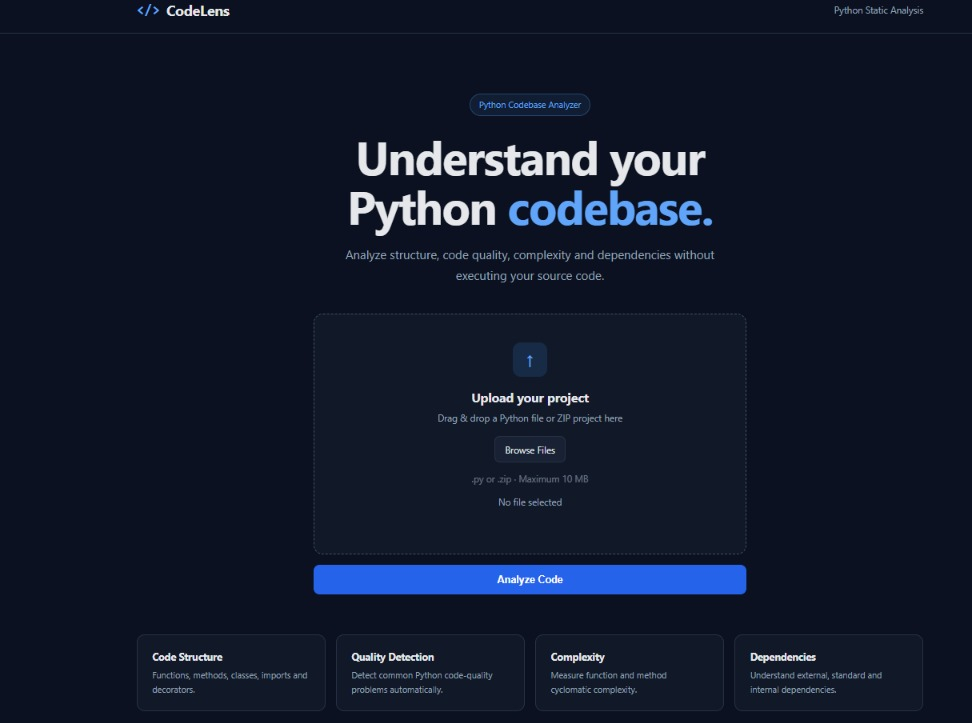
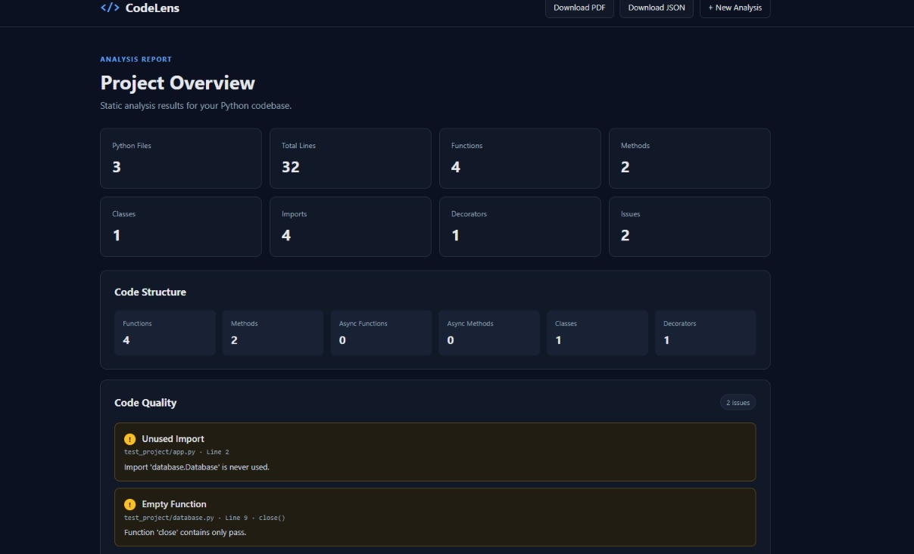
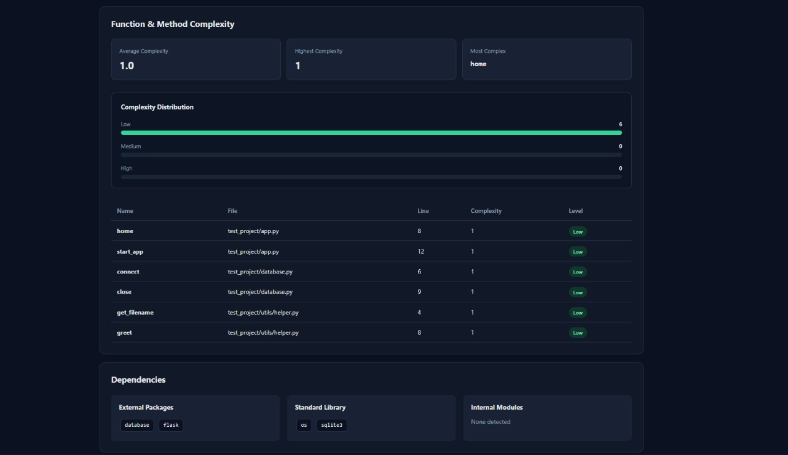
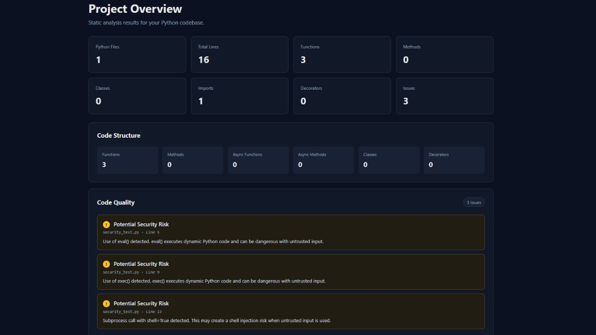
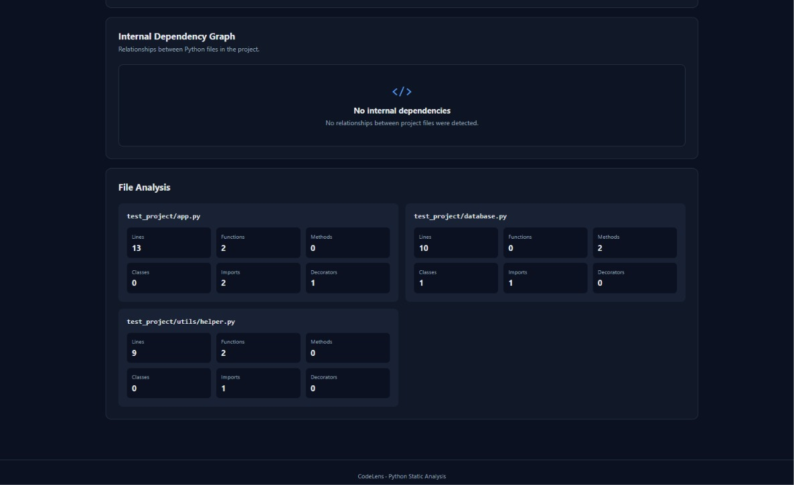

# CodeLens — Python Codebase Analyzer

CodeLens is a web-based static analysis tool for Python projects. It analyzes Python source code without executing it and presents code structure, quality issues, complexity metrics, dependencies, and internal module relationships through an interactive dashboard.

Users can analyze either a single `.py` file or an entire Python project packaged as a `.zip` file.

---

## Live Demo

CodeLens is deployed and available online:

**[Try CodeLens Live](https://codelens-inhe.onrender.com/)**

> The application is hosted on Render's free tier, so the first request after a period of inactivity may take some time to start.

---

## Screenshots

### Homepage

Upload a single Python file or a complete ZIP project using file selection or drag and drop.



### Analysis Dashboard

View project-level code structure, quality findings and complexity information.



### Complexity Analysis

Inspect cyclomatic complexity, project-level complexity statistics and complexity distribution.



### Code Quality & Security Analysis

Detect supported code-quality issues and potentially risky constructs with file and line information.



### Per-File Analysis

View structure metrics individually for every Python source file in the project.



---

## Features

### Code Structure Analysis

CodeLens uses Python's Abstract Syntax Tree (AST) to identify:

- Functions
- Methods
- Async functions
- Async methods
- Classes
- Imports
- Decorators
- Lines of code

Results are available both project-wide and per file.

### Code Quality Detection

The analyzer detects several common Python code-quality problems, including:

- Empty functions
- Mutable default arguments
- Bare `except` blocks
- Long functions
- Unused imports

Each issue includes its file and line number to make the result easier to investigate.

### Basic Security Checks

CodeLens detects potentially risky Python constructs such as:

- `eval()`
- `exec()`
- Subprocess calls using `shell=True`

These findings are warnings for review rather than proof that the code is vulnerable.

### Cyclomatic Complexity

CodeLens measures function and method cyclomatic complexity using Radon.

The dashboard provides:

- Complexity for each function/method
- Low, medium, and high complexity levels
- Average project complexity
- Highest detected complexity
- Most complex function/method
- Complexity distribution

### Dependency Analysis

Imports are classified into:

- Python standard-library modules
- External packages
- Internal project modules

CodeLens also builds an internal dependency graph to visualize relationships between Python files.

### Report Export

Analysis results can be exported as:

- PDF report
- JSON report

---

## Project Upload

CodeLens supports:

- A single `.py` file
- A complete Python project as a `.zip` file
- File browsing
- Drag-and-drop upload

For ZIP projects, CodeLens preserves the project structure while analyzing Python source files.

Common non-source directories are ignored, including virtual environments, caches, build output, Git metadata, and similar generated folders.

Test source files are still analyzed because they are part of the project's Python codebase.

---

## Upload Safety

The application applies several protections before analyzing uploaded projects:

- Maximum upload size: **10 MB**
- Maximum accepted extracted ZIP contents: **30 MB**
- Maximum useful Python files: **300**
- Maximum ZIP entries: **2,000**
- Encrypted ZIP files are rejected
- Unsafe ZIP paths are rejected
- Unsupported projects containing no Python source files are rejected
- Common irrelevant directories such as `venv`, `.venv`, `__pycache__`, `.git`, and `.pytest_cache` are excluded

Uploaded source files are stored only temporarily for analysis and are deleted after the analysis request completes.

CodeLens performs static analysis and does **not execute uploaded Python source code**.

---

## How It Works

```text
                    .py / .zip
                        │
                        ▼
                 Upload Validation
                        │
                        ▼
                  Project Filtering
                        │
                        ▼
                 Python Source Files
                        │
          ┌─────────────┼─────────────┐
          ▼             ▼             ▼
     AST Analysis   Complexity    Dependencies
          │             │             │
          ▼             ▼             ▼
      Structure      Metrics     Module Graph
          │             │             │
          └─────────────┼─────────────┘
                        ▼
                Analysis Dashboard
                        │
                 ┌──────┴──────┐
                 ▼             ▼
                PDF           JSON
```

---

## Tech Stack

**Backend**

- Python
- Flask

**Static Analysis**

- Python `ast`
- Radon

**Reporting**

- ReportLab

**Frontend**

- HTML
- CSS
- JavaScript
- Jinja2

**Production**

- Gunicorn

---

## Project Structure

```text
codelens/
│
├── analyzer/
│   ├── __init__.py
│   ├── code_analyzer.py
│   ├── complexity_analyzer.py
│   ├── dependency_analyzer.py
│   ├── file_filter.py
│   └── scanner.py
│
├── screenshots/
│   ├── homepage.jpeg
│   ├── analysis-dashboard.jpeg
│   ├── complexity-analysis.jpeg
│   ├── security-analysis.jpeg
│   └── file-analysis.jpeg
│
├── static/
│   └── css/
│       └── style.css
│
├── templates/
│   ├── error.html
│   ├── index.html
│   └── results.html
│
├── app.py
├── report_generator.py
├── requirements.txt
├── .gitignore
└── README.md
```

---

## Installation

### 1. Clone the repository

```bash
git clone https://github.com/NAVEENKUMAR-J-537/codelens.git
cd codelens
```

### 2. Create a virtual environment

```bash
python -m venv venv
```

### 3. Activate the virtual environment

Windows:

```bash
venv\Scripts\activate
```

Linux/macOS:

```bash
source venv/bin/activate
```

### 4. Install dependencies

```bash
pip install -r requirements.txt
```

### 5. Start CodeLens

```bash
python app.py
```

Then open:

```text
http://127.0.0.1:5000
```

---

## Requirements

The main project dependencies are:

```text
Flask==3.1.3
radon==6.0.1
reportlab==5.0.1
gunicorn
```

---

## Current Scope

CodeLens currently focuses on Python static analysis.

The quality and security checks are intentionally lightweight and do not replace dedicated tools such as full linters, type checkers, dependency vulnerability scanners, or security auditing platforms.

The internal dependency graph focuses on relationships that CodeLens can resolve between project modules.

---

## Future Improvements

Possible future enhancements include:

- Additional code-quality rules
- More security checks
- Configurable analysis thresholds
- Richer dependency visualization
- Support for additional programming languages
- Expanded automated testing

---

## Privacy

Uploaded source code is analyzed temporarily and removed after processing. CodeLens does not intentionally execute uploaded Python code or permanently store uploaded projects.

---

## Author

**Naveenkumar J**

B.E. Computer Science and Engineering